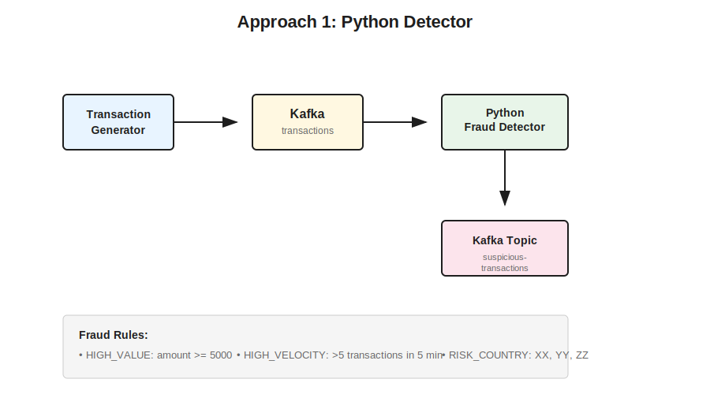
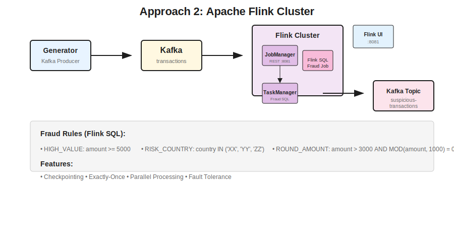

# Real-Time Fraud Detection

Two approaches to demonstrate real-time fraud detection:

- **Approach 1**: Kafka + Generator + Python Detector (with checkpoint simulation)
- **Approach 2**: Kafka + Flink Cluster + Generator (SQL-based fraud detection)

---

## Requirements

| Tool | Version | Required |
|------|---------|----------|
| Docker | 20.10+ | Yes |
| Docker Compose | 2.0+ | Yes |
| Python | 3.10+ | For local development |
| make | Any | Yes |

### Install Prerequisites

**macOS:**
```bash
# Install Docker Desktop
brew install --cask docker

# Python (if needed)
brew install python
```

**Linux (Ubuntu/Debian):**
```bash
sudo apt update
sudo apt install docker.io docker-compose python3 make
```

**Verify Installation:**
```bash
docker --version
docker compose version
python3 --version
make --version
```

---

## Architecture Diagram

### Approach 1: Python Detector



### Approach 2: Apache Flink Cluster



---

## Quick Start

### Approach 1 (With Checkpoint Simulation)

```bash
make up
```

Features:
- Python detector with checkpoint simulation
- Detects HIGH_VALUE and HIGH_VELOCITY
- Checkpoint info shown in alerts

```bash
# Watch alerts
docker exec docker-kafka-1 kafka-console-consumer --topic suspicious-transactions --from-beginning --bootstrap-server localhost:9092
```

---

### Approach 2 (Flink Cluster - Auto Job Submission)

```bash
make up-flink
```

Features:
- Flink JobManager + TaskManager running
- Fraud detection job **automatically submitted**
- Flink UI: http://localhost:8081
- Suspicious transactions written to Kafka topic

```bash
# Watch suspicious transactions
docker exec docker-kafka-1 kafka-console-consumer --topic suspicious-transactions --from-beginning --bootstrap-server localhost:9092

# Or view Flink UI
# http://localhost:8081
```

---

## Comparison

| Feature | Approach 1 | Approach 2 |
|---------|-----------|------------|
| Processor | Python | Flink SQL |
| Checkpoint | Simulated | Real |
| Job in Flink UI | No | Yes (auto-submitted) |
| Output | Kafka topic | Kafka topic |
| Complexity | Low | Medium |
| Use Case | Demo/checkpoint sim | Production-like |

---

## Tech Stack

| Component | Version |
|-----------|---------|
| Kafka | 7.5.0 |
| Zookeeper | 7.5.0 |
| Apache Flink | 1.18 |
| Python | 3.11 |
| kafka-python-ng | 2.2.3 |

---

## Makefile Commands

```bash
make up        # Start Approach 1
make up-flink  # Start Approach 2 (Flink cluster only)
make down      # Stop all
make clean     # Clean up
```

---

## Stop

```bash
make down
```
